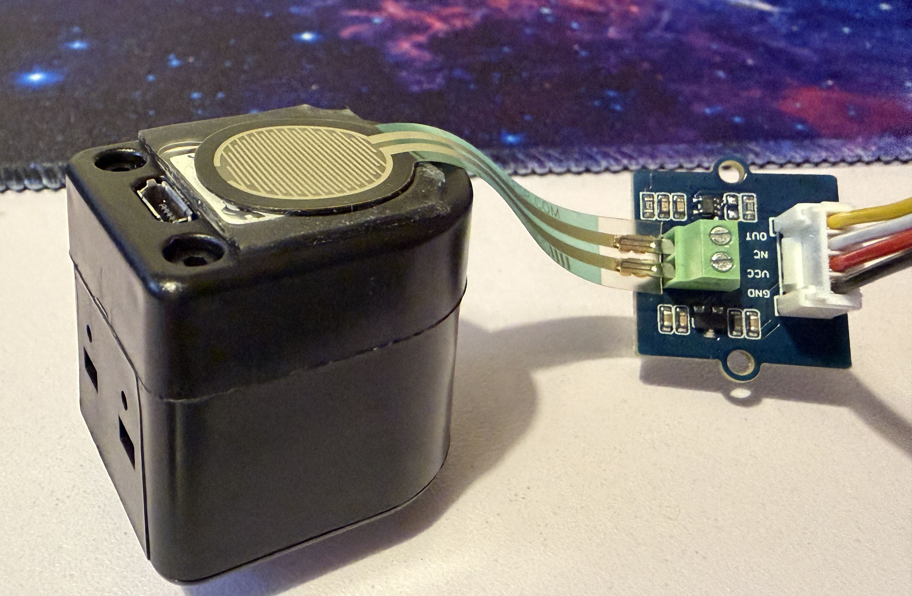

# Digit-Force-Calibration
**Digit-Force-Calibration** is a collection of utilities and data for calibrating an FSR force sensor (attached to the rear of a DIGIT sensor) using a Raspberry Pi Pico.



## Contents

This repo contains:
- `data/` - the collected CSV data.
- `pico/` — Raspberry Pi Pico scripts for data collection and calibration:
	- `force_calibration.py` - a calibration routine for measuring voltage at different weights on a scale (for Newton conversion).
	- `force_motion_data_collect.py` - a sliding and rotation data collection script for five different objects across three target force levels.  
	- `force_press_data_collect.py` - a long press data collection script for five different objects.  
	- `force_press_position_data.py` - a long press data collection script for a tennis ball in three different positions (top, side, bottom).
	- `main.py` - a script that continuosly streams current voltage reading via USB that automatically runs when Pico is connected.
- `plots/` - plots generated by the calibration notebook.
- `calibration.ipynb` - an interactive notebook for exploring calibration results.
- `receive_force_data.py` - a Python script for listening to streamed USB force readings and printing on key press.

## Requirements

- **Operating System:** Windows, Mac, Linux
- **Tested Environment:** Ubuntu 22.04, Python 3.10.12
- **Python Environment:** Regular Python or Anaconda environment
- **Packages:** See `requirements.txt`

## Installation

### 1. Clone the repository

```bash
git clone https://github.com/gemixin/digit_force_calibration.git
cd digit_force_calibration
```

### 2. Install dependencies

#### Option A: With pip

1. **(Optional) Set up a virtual environment:**
    ```bash
    python3 -m venv .venv
    source .venv/bin/activate
    ```

2. **Install the required package:**  
    ```bash
    python3 -m pip install -r requirements.txt
    ```

#### Option B: With Anaconda

Create a new conda environment using the provided `environment.yml`:

```bash
conda env create -f environment.yml
conda activate digit_force_calibration